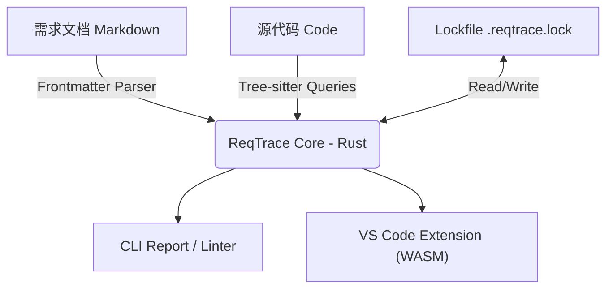

# ReqTrace: 现代化的代码需求追踪引擎

## 1. 核心愿景 (Vision)

**"Code Changes, Requirements Endure."**

ReqTrace 是一个**语言无关**、**非侵入式**的静态分析工具。它连接产品需求文档（Markdown）与源代码（Code Comments），通过 CI/CD 门禁确保每一行关键代码都有据可依，每一个需求变更都能触发测试的同步更新。

### 核心哲学

1. **Docs-as-Code**: 需求即代码，纳入版本控制（Git），与源码同仓或作为子模块。
2. **Zero Runtime Dependency**: 纯二进制工具（Rust），不污染业务代码，无需引入 SDK。
3. **Language Agnostic**: 不依赖特定语言的编译器，通过 Tree-sitter 支持任意编程语言。
4. **Quality Gate**: 不止统计覆盖率，更通过 Hash 校验防止“需求变了但测试没变”的虚假覆盖。

---

## 2. 技术架构 (Architecture)

### 2.1 技术选型

-   **开发语言**: **Rust**
-   **解析引擎**: **Tree-sitter**
-   **并行处理**: **Rayon**
-   **文档解析**: **pulldown-cmark** + **serde_yaml** (处理 Markdown + Frontmatter)
-   **状态管理**: JSON Lockfile (实现增量检测与过期警告)
-   **CLI 接口**: **clap**

### 2.2 系统分层



---

## 3. 标准化需求格式 (The ReqSpec)

放弃纯 YAML，采用 **Markdown + Frontmatter**，兼顾人类可读性与机器可解析性。

**文件示例**: `requirements/auth/REQ-01-login-lock.md`

```markdown
---
id: REQ-01
title: 登录暴力破解防护
type: requirement
priority: high
status: draft
tags: [security, auth]
owner: @security-team
---

# 登录暴力破解防护

为了防止恶意用户通过字典攻击猜解密码，系统必须具备账户锁定机制。

## 业务背景

当用户连续输入错误密码时，系统应暂时冻结该账户。
[设计图链接](./assets/lock-flow.png)

## 验收标准

### AC-01: 触发锁定

-   **Given**: 账户处于正常状态
-   **When**: 用户在 5 分钟内连续输错密码 5 次
-   **Then**: 账户被锁定 30 分钟
-   **And**: 向用户发送安全警告邮件

### AC-02: 锁定期间尝试

-   **Given**: 账户已被锁定
-   **When**: 用户输入**正确**的密码
-   **Then**: 拒绝登录，并提示"账户锁定中"
```

**解析规则**:

1. **Frontmatter**: 提取 ID, Title, Priority 等元数据。
2. **Headings (###)**: 识别为验收场景 (Scenario)，自动生成子 ID (如 `REQ-01.AC-01`)。
3. **Content**: 作为文档展示在报告或 IDE 悬停提示中。

---

## 4. 追踪协议 (Traceability Protocol)

### 4.1 标记语法

在测试代码或业务代码的注释中使用统一的标记：

```
@reqtrace:<ID> [metadata]

```

### 4.2 多语言示例

**TypeScript / JavaScript**:

```typescript
/**
 * Test account locking logic
 * @reqtrace:REQ-01.AC-01 (关联具体验收标准)
 */
test("should lock account after 5 failed attempts", async () => {
    // ...
});
```

**Python**:

```python
def test_login_lock():
    """
    Verify locking mechanism
    @reqtrace:REQ-01.AC-01
    @reqtrace:REQ-01.AC-02
    """
    assert login_service.is_locked(user_id)

```

**Rust**:

```rust
/// Check lock duration
/// @reqtrace:REQ-01.AC-01
#[test]
fn test_lock_duration() {
    // ...
}

```

---

## 5. 核心特性深挖

### 5.1 智能防腐机制 (Stale Check / Lockfile)

这是 ReqTrace 区别于普通 Regex 扫描器的核心壁垒。

1. **指纹计算**: 扫描 Markdown 时，计算有效内容（排除空行）的 SHA256 Hash。
2. **状态对比**: 读取 `.reqtrace.lock` 文件。

-   **Match**: 需求未变，测试有效 ✅
-   **Mismatch**: 需求已变，测试处于 "Stale" 状态 ⚠️

3. **工作流**:

-   PM 修改 Markdown -> 提交代码。
-   CI 运行 `reqtrace lint` -> **报错**："REQ-01 changed but tests not verified."
-   开发人员更新测试代码 -> 运行 `reqtrace ack REQ-01` -> 更新 Lockfile -> 提交代码。

### 5.2 覆盖率报告

-   **Requirement Coverage**: 多少需求关联了测试？
-   **Scenario Coverage**: 多少验收标准（AC）被关联了？（更细粒度的质量指标）
-   **Stale Ratio**: 有多少测试是过期的？

---

## 6. 常见问题 (FAQ)

**Q: 为什么不用 Cucumber (Gherkin)?**
A: Cucumber 强迫你使用特定的测试运行器（Runner）和繁琐的正则匹配步骤定义。ReqTrace 允许你使用现有的测试框架（Jest, Pytest, Go Test），以非侵入的方式（注释）实现追踪。我们提供 Gherkin 的**清晰度**（在 Markdown 中），但没有任何**运行时负担**。

**Q: 为什么不用 Python/Node 写 CLI？**
A: 1. **性能**: 大型仓库扫描需要毫秒级响应。2. **分发**: Rust 单一二进制文件无需用户配置 Runtime 环境，这对非 Node/Python 团队极其友好。3. **Tree-sitter**: Rust 绑定最成熟。

**Q: 如果我重命名了需求 ID 怎么办？**
A: 在 MVP 阶段，请使用 IDE 的全局查找替换。在 Phase 2，VS Code 插件将提供辅助重命名功能。

**Q: 需求文件放在哪里？**
A: 推荐放在代码仓库的 `docs/requirements` 或 `specs` 目录下。保持与代码同源，享受 Git 的分支管理和 Code Review 流程。

---

## 7. 快速开始 (Quick Start)

### 安装

```bash
# 克隆仓库
git clone <repo-url>
cd reqtrace

# 构建
cargo build --release

# 可选：全局安装
cargo install --path .
```

### 运行示例

```bash
# 方式 1: 单个需求文件 + 单个代码文件
cargo run -- check \
  --requirement examples/requirements/REQ-01-login-lock.md \
  --code examples/python/test_auth.py

# 方式 2: 目录扫描（自动递归扫描 .md 和代码文件）
cargo run -- check \
  --requirement examples/requirements/ \
  --code examples/python/

# 方式 3: 通配符模式（支持 glob 语法）
cargo run -- check \
  --requirement "examples/requirements/*.md" \
  --code "examples/**/*.py"

# 方式 4: 多个代码路径（支持混合文件、目录、模式）
cargo run -- check \
  --requirement requirements/ \
  --code "src/**/*.py" "tests/**/*.py" "lib/core.py"
```

### 当前实现状态

**已完成 (v0.1)**:
- ✅ Markdown 需求文件解析（Frontmatter + 验收标准）
- ✅ SHA256 内容哈希计算（用于防腐机制）
- ✅ Python 代码扫描（基于 Tree-sitter）
- ✅ `@reqtrace:ID` 引用提取
- ✅ 覆盖率报告生成
- ✅ CI/CD 友好的退出码
- ✅ **目录递归扫描**（基于 walkdir）
- ✅ **通配符模式支持**（`*.md`, `tests/**/*.py` 等，基于 globset）
- ✅ **并行处理**（基于 rayon，加速大型仓库扫描）
- ✅ **智能输入识别**（自动检测文件/目录/模式）
- ✅ **错误收集与统一报告**（部分文件失败不影响整体扫描）

**待开发**:
- ⏳ Lockfile 机制（staleness 检测）
- ⏳ HTML 报告生成
- ⏳ 更多语言支持（TypeScript, Rust, Go）
- ⏳ VS Code 扩展
- ⏳ 默认排除规则（target/, node_modules/, .git/ 等）
- ⏳ 进度显示（大型仓库扫描时）

更多示例和详细输出请查看 `examples/README.md`。
